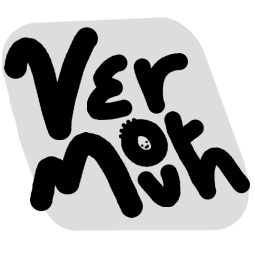

# `vermouth`
A new kind of parser for procedural macros.

# License

Everything in this repository is dual-licensed under either: 

* MIT License ([LICENSE-MIT](LICENSE-MIT) or <http://opensource.org/licenses/MIT>)
* Apache License, Version 2.0 ([LICENSE-APACHE](LICENSE-APACHE) or <http://www.apache.org/licenses/LICENSE-2.0>)

at your option, unless explicitly stated otherwise.
